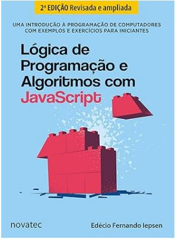

# Lógica de Programação e Algoritmos com JavaScript
O livro Lógica de Programação e Algoritmos com JavaScript apresenta, de forma didática e progressiva, os fundamentos essenciais da programação, utilizando o JavaScript como linguagem base. A obra é voltada principalmente para iniciantes, mas também é útil para quem deseja reforçar conceitos teóricos e práticos de lógica computacional.

Ao longo do livro, o leitor aprende a pensar de forma estruturada para resolver problemas, compreendendo o que são algoritmos e como transformá-los em código. São abordados conceitos fundamentais como variáveis, tipos de dados, operadores, estruturas condicionais (if/else), estruturas de repetição (for, while), vetores, funções e noções básicas de modularização.

Um dos pontos fortes da obra é o uso constante de exemplos práticos em JavaScript, que ajudam a conectar a teoria com a prática. Os exercícios propostos estimulam o raciocínio lógico e a construção de soluções passo a passo, facilitando a assimilação dos conceitos.

Além disso, o livro enfatiza boas práticas de programação, como clareza, organização e legibilidade do código, preparando o leitor para avançar em estudos mais complexos em desenvolvimento de software. De modo geral, trata-se de uma leitura introdutória sólida para quem deseja iniciar na programação e desenvolver uma base consistente em lógica e algoritmos usando JavaScript.

